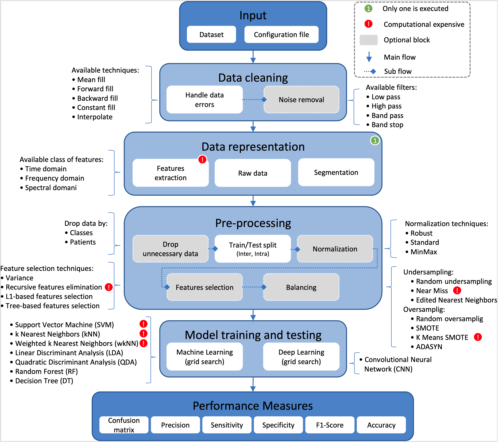

## Overview
This repository hosts **B-HAR**, a baseline framework for in depth study of human activity recognition. 
B-HAR gives to researchers the possibility to evaluate  and  compare  HAR  methodologies with a common well-defined workflow.

Users can interact with B-HAR by using two exposed methods:

* `stats`
* `get_baseline`

The `stats` call return an overview of the dataset under analysis, by giving useful statistics such as data distribution, 
standard deviation etc.

The `get_baseline` method takes as input machine learning ad deep learning models (see `b_har/utility/models.py`) 
which are going to be applied to classify the input data.
It can also a list of patient or activity class to discard from the dataset under analysis.

Other settings such as define the input dataset, workflow, data filtering, etc. can be easily customised in the 
`config.cfg` file.

## Installation
B-HAR requires `python3.6` or higher, you can easily install the package by using `pip` with the following command:
```
pip install -i https://test.pypi.org/simple/ B-HAR-baseline-framework
```
<!-- 
## Workflow

B-HAR takes in input  two files containing, respectively, 
i) the  dataset,  i.e.,  values  of  the  signals  perceived  
by  sensorsduring  human  activities,  enriched  by  information  concerning the  testing  subject  identity,  the  data
collection  session,  and the  performed  activity  at  a  specific  timestamp,  and  
ii)  aconfiguration file that defines the library workflow.

The data cleaning phases is devoted to handle data errors:
i) missing and inconsistent data, such  as  NaN,  or  Inf,
ii) time series noise removal which is an essential and  indisputable  step  in  HAR  signal  processing.

B-HAR provides to the user with the  possibility  of  selecting  one  of  the following  data treatment procedures:
i) raw data which means that no data treatment is carried out,
ii) segmentation, B-HAR creates time-window segment based on sampling frequency and desired window length, while 
iii) the feature extraction process explores  the  time  and  frequency  domains  of  the  input  data


-->

## Get started
In order to start using B-HAR you have to follow these two steps:
* Edit the configuration file
* Start the analysis

The code below shows how to use B-HAR.
```python
from b_har.baseline import B_HAR

cfg_file = '/path_to_your_config_file/config.cfg'

b_har = B_HAR(config_file_path=cfg_file)
b_har.stats()
b_har.get_baseline(['K-NN', 'DT', 'LDA'], ['m1_acc'])
```
You can find a full example and how to use and set the configuration file in the `example` directory.

## Outputs
Once started, B-HAR will create a log directory in which all analysis outputs will be saved. B-HAR will report training 
stats for both machine learning and deep learning, a sep-by-step recap will be reported in `log.rft` together with a backup
of the configuration file used.
